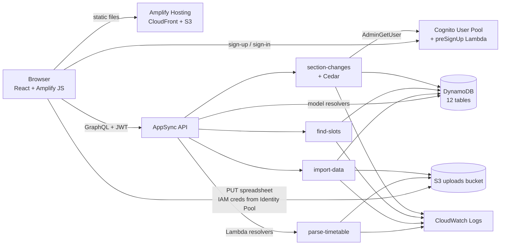

# AWS.md — how Slate is built on AWS

This file explains Slate in AWS terms: which services we used and how each was configured, how they're wired together, what happens inside AWS on each user action, and why. For the lessons and the judges' feedback, see [`CONTEXT.md`](CONTEXT.md).

**Region:** `ap-south-1` (Mumbai) · **Live:** https://main.dosqfo1xoqa7l.amplifyapp.com · **Cost:** $0.00 month-to-date

---

## 1. The whole picture



| AWS service | Role in Slate |
|---|---|
| **AWS Amplify Gen 2** | Infrastructure as code in TypeScript (`slate/amplify/`). It compiles to **AWS CDK**, which deploys **CloudFormation** stacks |
| **Amplify Hosting** | Serves the built React app over its CDN at a public URL |
| **Amazon Cognito** | User Pool (accounts, JWTs, `ADMIN` group) and Identity Pool (temporary IAM credentials for S3) |
| **AWS Lambda** | Five functions: `pre-sign-up`, `parse-timetable`, `import-data`, `find-slots`, `section-changes` |
| **AWS AppSync** | The GraphQL API: generated CRUD for models, plus custom queries and mutations backed by Lambda |
| **Amazon DynamoDB** | Twelve on-demand tables, secondary indexes (GSIs), TTL on `ScheduleChange` |
| **Amazon S3** | Stores uploaded timetable and student spreadsheets |
| **AWS IAM** | Every Lambda gets only the table and bucket permissions it needs |
| **Amazon CloudWatch Logs** | A structured JSON line per authorization decision, slot search and import |
| **Cedar** (open-source policy language from AWS, via `@cedar-policy/cedar-wasm`) | Decides who may change a timetable, inside `section-changes` |

---

## 2. Infrastructure as code: Amplify Gen 2 → CDK → CloudFormation

We never clicked a resource into existence in the console. Everything is defined in TypeScript:

```
slate/amplify/
  backend.ts                 defineBackend({...}) + CDK overrides (IAM grants, env vars, TTL)
  auth/resource.ts           defineAuth    → Cognito User Pool, Identity Pool, ADMIN group
  auth/pre-sign-up/          defineFunction → Lambda attached as a Cognito trigger
  data/resource.ts           defineData    → AppSync API + one DynamoDB table per model
  storage/resource.ts        defineStorage → S3 bucket + IAM policies per path
  functions/*/resource.ts    defineFunction → Lambda functions
```

**How it deploys:**
- `npx ampx sandbox` synthesizes the definitions into a CDK app, then CloudFormation creates a **root stack with nested stacks** (auth, data, storage, functions). Ours is `amplify-slate-kavyan2-sandbox-8135cfd1ea`.
- It writes `amplify_outputs.json` (User Pool ID, AppSync URL, bucket name, region). The frontend reads this file with `Amplify.configure(outputs)`. It's gitignored; each developer generates their own with `npx ampx generate outputs`.
- `amplify.yml` is also set up for the CI path: `npx ampx pipeline-deploy --branch $AWS_BRANCH --app-id $AWS_APP_ID`, then `npm run build`.

**Escape hatches to raw CDK/CloudFormation** (in `backend.ts`) for what the Amplify DSL doesn't cover:

```ts
// 1. IAM: grant a Lambda access to specific tables, and pass the table names as env vars
tables['ScheduleChange'].grantReadWriteData(changesFn);
tables['TimetableSlot'].grantReadData(changesFn);
backend.sectionChanges.addEnvironment('SCHEDULE_CHANGE_TABLE', tables['ScheduleChange'].tableName);

// 2. IAM: let one Lambda read users from Cognito
backend.auth.resources.userPool.grant(changesFn, 'cognito-idp:AdminGetUser');

// 3. CloudFormation property override: DynamoDB TTL
backend.data.resources.cfnResources.amplifyDynamoDbTables['ScheduleChange']
  .timeToLiveAttribute = { attributeName: 'expiresAt', enabled: true };
```

**Stack-dependency detail:** the Lambdas that read data tables are declared with `resourceGroupName: 'data'`, which puts them in the **data nested stack**. Otherwise the data stack (which references the functions as resolvers) and the function stack (which references the tables) depend on each other, and CloudFormation rejects the cycle.

---

## 3. Amazon Cognito: identity

### User Pool
- **Sign-in with email** (`loginWith: { email: true }`), so the email is the username and is verified by a code.
- **A preSignUp Lambda trigger** (`auth/pre-sign-up/handler.ts`). Cognito invokes it synchronously before creating any user. If the email isn't `@iiita.ac.in`, it throws, and Cognito refuses the sign-up. This is the closed-community boundary, enforced by AWS rather than by our UI.
- **A User Pool group, `ADMIN`.** Membership appears in the JWT as `cognito:groups`. AppSync and the Lambdas read it to grant admin rights. Only someone with AWS access can add a member (console or `aws cognito-idp admin-add-user-to-group`), so students can't promote themselves.
- **A custom attribute, `custom:role`**, for display only. It is never trusted for authorization.

### Identity Pool
Amplify also creates a Cognito **Identity Pool**. It exchanges a signed-in user's token for **temporary IAM credentials (STS)**. The `ADMIN` group gets its own IAM role. That's how the browser can upload to S3 directly, but only for admins (§6).

### What the browser does
`<Authenticator>` from `@aws-amplify/ui-react` provides the sign-up and sign-in screens. Amplify JS stores the tokens, refreshes them, and attaches the **access token** to every AppSync request (`defaultAuthorizationMode: 'userPool'`).

### Demo accounts for judges
Sign-up is domain-gated, so we created accounts with `aws cognito-idp admin-create-user` and `admin-set-user-password --permanent`. The passwords are in the README; the commands are in a gitignored local file.

---

## 4. AWS AppSync + Amazon DynamoDB: the API and the database

### What `defineData` creates
- **One AppSync GraphQL API**, authorized by the Cognito User Pool.
- **One DynamoDB table per model** (12): Course, Offering, ClassMeeting, Registration, Student, User, TimetableSlot, ScheduleChange, ClassRep, RollRange, StudentSection, Enrollment. On-demand billing, so we pay nothing while idle.
- **Generated resolvers** for each model's list, get, create, update and delete operations, with the authorization rules compiled into them.
- **Global Secondary Indexes** from `.secondaryIndexes(...)`, e.g. `Registration` by `rollId` and by `offeringKey`, and `ScheduleChange` by `offeringKey` + `date`.
- **A typed client.** `generateClient<Schema>()` gives the frontend `client.models.X.list()`, `client.queries.findSlots(...)` and `client.mutations.cancelOccurrence(...)` with TypeScript types generated from the schema.

### Authorization per model (enforced by AppSync before DynamoDB is touched)

| Model | AppSync rule | Effect |
|---|---|---|
| Course, Offering, ClassMeeting, Registration, TimetableSlot, RollRange | `authenticated().to(['read'])` + `group('ADMIN')` | Everyone signed in reads, admins write |
| Student, StudentSection, Enrollment | `group('ADMIN')` only | Personal data. Students can't list it |
| User | `owner()` + `authenticated().to(['read'])` | You edit only your own profile |
| **ScheduleChange** | `authenticated().to(['read'])` **only** | **No user can write it through the API**, admins included. Only the `section-changes` Lambda writes it, via IAM |
| ClassRep | read for all; `ADMIN` read + delete | Claiming goes through the Lambda; an admin revokes by deleting the row |

### Custom operations backed by Lambda (AppSync Lambda resolvers)
When a request needs logic, cross-table reads, or a scoped view of admin-only data, the schema declares an operation and points it at a function:

```ts
cancelOccurrence: a.mutation()
  .arguments({ meetingId: a.id().required(), date: a.string().required() })
  .returns(a.json())
  .handler(a.handler.function(sectionChanges))
  .authorization((allow) => [allow.authenticated()]),
```

| Operation | Type | Lambda | Who may call (AppSync) |
|---|---|---|---|
| `myTimetable`, `mySection`, `batchRoster` | query | section-changes | any signed-in user (the Lambda scopes the answer to the caller) |
| `claimCr`, `cancelOccurrence`, `addExtra`, `moveOccurrence`, `undoChange` | mutation | section-changes | any signed-in user (**Cedar** then decides) |
| `findSlots` | query | find-slots | any signed-in user |
| `parseTimetable` | query | parse-timetable | `ADMIN` group |
| `importData` | mutation | import-data | `ADMIN` group |

AppSync passes the Lambda an event containing `arguments`, `fieldName` and **`identity`**: the token-verified `sub`, `username` and `groups`. That identity is the only thing the Lambdas trust.

### DynamoDB TTL
Each `ScheduleChange` row has `expiresAt` (epoch seconds: the Monday after the change's week). With TTL enabled on that attribute, DynamoDB deletes expired rows itself, with no cron job, no Lambda and no write cost.

---

## 5. AWS Lambda: the four application functions

All are TypeScript, bundled by Amplify with esbuild, and use AWS SDK v3 (`@aws-sdk/lib-dynamodb`, `client-s3`, `client-cognito-identity-provider`). Table and bucket names come in as **environment variables**. Permissions come from **the IAM execution role** CDK generates from the grants in `backend.ts`.

| Function | Trigger | Timeout / memory | Reads | Writes | IAM grants |
|---|---|---|---|---|---|
| `pre-sign-up` | Cognito preSignUp | defaults | the sign-up event | none | none |
| `parse-timetable` | AppSync query (ADMIN) | 60 s / 1024 MB | S3 object | none (returns JSON) | S3 read on `timetable-uploads/*` |
| `import-data` | AppSync mutation (ADMIN) | 120 s / 1024 MB | S3 object, 9 tables | 9 tables (unless `dryRun`) | S3 read; `grantReadWriteData` on 9 tables |
| `find-slots` | AppSync query | 30 s / default | 8 tables | none | `grantReadData` on 8 tables |
| `section-changes` | AppSync queries + mutations | 30 s / 512 MB | 9 tables, Cognito | ScheduleChange, ClassRep | read on 7 tables, read-write on 2, `cognito-idp:AdminGetUser` |

**The least-privilege point:** `find-slots` *cannot* write anything. `section-changes` can write only the two tables it owns. Only `import-data` can write reference data, and only admins can invoke it.

### `section-changes`: authorization with Cedar
1. **Resolve who is calling.** AppSync access tokens carry no email, so the Lambda calls **`AdminGetUser`** on the User Pool with the token-verified username, and accepts the email only if `email_verified` is `true`. Results are cached in memory for the life of the warm container.
2. **Derive facts server-side.** Roll number from the email → section from the admin-uploaded `StudentSection` table (falling back to `RollRange`) → CRs from `ClassRep` → which sections an offering reaches from `Registration`. Nothing comes from the request except the target (`meetingId`, `date`, …).
3. **Ask Cedar.** Build principal and resource entities and call `isAuthorized()` against `policy.cedar`.
4. **Log, then act or refuse.** `console.log(JSON.stringify({ cedar: 'allow'|'deny', action, email, principal, resource }))` goes to CloudWatch. On allow, write rows with `BatchWriteCommand` (one row per affected section, sharing a `groupId`, with `changedBy` and `expiresAt`).

**Packaging Cedar for Lambda:** the bundler can't ship `.wasm` or `.cedar` files, so `resource.ts` runs at CDK synth time. It reads the Cedar WebAssembly binary and `policy.cedar`, and writes them into a generated TypeScript module (base64 + string). The handler calls `initSync()` once per cold start. No Lambda layer, no extra service.

### `find-slots`: pure computation
Reads offerings, meetings, registrations, changes and students. Builds each attendee's busy intervals for each candidate date (regular classes − cancellations + extras), plus the professor's. Intersects the free time, filters by constraints, ranks with written reasons, and picks a free room. If nothing is free, it reports the bottleneck. Logs `{"event":"slots-found", attendees, candidates, free, ...}`.

### `parse-timetable` and `import-data`: two-phase ingestion
- `parse-timetable` downloads the workbook from S3 (`GetObjectCommand`), reads it with `exceljs` (merged cells included), and returns rows plus validation issues. **It writes nothing.**
- `import-data` re-reads the file, diffs against DynamoDB, and writes only if `dryRun: false`. Writes use `BatchWriteCommand` in chunks of 25 (the DynamoDB limit), **retrying `UnprocessedItems` with exponential backoff** (200 ms × 2ⁿ, 5 attempts). Logs `import-checked` or `import-applied`, with who did it and the counts.

---

## 6. Amazon S3: uploads

```ts
defineStorage({
  name: 'timetableUploads',
  access: (allow) => ({
    'timetable-uploads/*': [
      allow.groups(['ADMIN']).to(['read', 'write']),   // the ADMIN group's IAM role
      allow.resource(parseTimetable).to(['read']),      // Lambda execution role
      allow.resource(importData).to(['read']),
    ],
  }),
});
```

- The admin's browser uploads directly with `uploadData({ path, data: file })`, signed with the Identity Pool's temporary credentials for the `ADMIN` role. A large workbook never passes through a Lambda payload or AppSync, which have size limits.
- The browser then calls `parseTimetable(key)` with only the **object key**. The Lambda also refuses any key outside `timetable-uploads/`.
- Students have no S3 permissions at all.

---

## 7. Amazon CloudWatch: observability

Each Lambda writes to its own log group, `/aws/lambda/<function-name>`. Every important event is **one JSON line**, so it's greppable and works with CloudWatch Logs Insights:

```json
{"cedar":"deny","action":"Cancel","email":"iit2024059@iiita.ac.in","principal":{"role":"STUDENT","section":"B.Tech|IT|5|A"},"resource":"..."}
{"event":"slots-found","offering":"...","attendees":109,"candidates":40,"free":12}
{"event":"import-applied","by":"...","sheet":"IT Sem 5","added":246,"changed":0,"removed":0}
{"event":"upload-parsed","key":"timetable-uploads/...","summary":["IT Sem 5: timetable, 246 rows, 0 skipped, 3 issues"]}
```

Shown live in the demo video:

```bash
aws logs tail /aws/lambda/<section-changes-function> --since 15m --region ap-south-1 | grep cedar
```

---

## 8. Amplify Hosting: the public URL

- App `dosqfo1xoqa7l`, branch `main` → `https://main.dosqfo1xoqa7l.amplifyapp.com`, served over Amplify's managed CDN with HTTPS.
- **How we deployed:** a manual deployment (`scripts/deploy-frontend.sh`) running `npm run build`, zipping `dist/`, then `aws amplify create-deployment` → PUT the zip to the presigned URL → `start-deployment` → poll `get-job` until `SUCCEED`. This used no build minutes and took seconds.
- **The CI path** (`amplify.yml`, connect the GitHub repo) deploys backend and frontend together on every push to `main`. We set it up but didn't switch to it; doing that from day 1 is a lesson in `CONTEXT.md`.

---

## 9. What happens inside AWS, step by step

**Sign-up:** browser → Cognito `SignUp` → **preSignUp Lambda** checks the domain → Cognito emails a code → `ConfirmSignUp` → user exists.

**A student opens their week:** browser (JWT) → AppSync `myTimetable` → AppSync checks the token → **section-changes** Lambda → `AdminGetUser` (email) → DynamoDB reads (student, registrations, offerings, meetings, CRs) → JSON back. Then `client.models.ScheduleChange.list` → AppSync model resolver → DynamoDB → this week's and next week's changes.

**A CR cancels a class:** browser → AppSync `cancelOccurrence(meetingId, date)` → section-changes → resolve email and section → date checks (not past, within two weeks) → **Cedar `isAuthorized`** → CloudWatch log line → `BatchWriteCommand` into `ScheduleChange` (one row per affected section, with `expiresAt`) → other students see it on their next read. The following Monday, **TTL** deletes it.

**A student tries the same:** same path; Cedar returns `deny`, the deny line is logged, and the Lambda throws. AppSync returns a GraphQL error. Calling `createScheduleChange` directly doesn't work either, because AppSync allows only reads on that model.

**A CR looks for a makeup slot:** AppSync `findSlots` → **find-slots** Lambda → DynamoDB reads → interval intersection → ranked slots with reasons and rooms, or the bottleneck → CloudWatch `slots-found`.

**An admin imports a timetable:** S3 `PutObject` (Identity Pool, ADMIN role) → AppSync `parseTimetable` (ADMIN only) → Lambda `GetObject`, parse, validate → admin reviews → `importData(dryRun: true)` → diff shown → `importData(dryRun: false)` → batched writes with retries → CloudWatch `import-applied`.

---

## 10. Security in layers

| Layer | Mechanism | Stops |
|---|---|---|
| Who can exist | Cognito preSignUp Lambda | anyone outside `@iiita.ac.in` |
| Who is calling | Cognito JWT verified by AppSync; email from `AdminGetUser` (verified only) | spoofed identities; trusting a user-editable profile |
| What the API allows | AppSync per-model rules, group-only models, read-only `ScheduleChange` | direct API calls that bypass the app or the policy |
| What a user may change | Cedar policy in the Lambda, with facts derived from server-side data | a student acting as a CR; a CR editing another section's course |
| What code may touch | IAM execution roles with per-table grants | a bug in one function corrupting data it shouldn't own |
| What files may be read | S3 path policies per group and per function | students reading uploaded lists; keys outside the prefix |
| Audit | CloudWatch JSON lines; `changedBy` / `undoneBy` on every change | untraceable changes |
| Secrets | No AWS keys in the repo; Amplify/CDK manage roles; `amplify_outputs.json` gitignored | leaked credentials |

---

## 11. Cost

| Service | Why it's ~free |
|---|---|
| Lambda | Pay per request and millisecond; free tier covers 1M requests per month |
| DynamoDB | On-demand, so no idle cost; tiny storage; TTL deletes are free |
| AppSync | Pay per request |
| Cognito | Free tier covers far more monthly active users than a campus |
| S3 | A few MB of spreadsheets |
| Amplify Hosting | A small static site; manual deploys used no build minutes |
| CloudWatch Logs | A few KB per day |

**Deliberately not used:** EC2, ECS/Fargate, EKS (nothing needs a long-running server), RDS (no relational joins at a scale DynamoDB can't handle), **NAT Gateway** (no Lambda is in a VPC, which also removes the most common surprise bill), OpenSearch and vector stores (there's no search or similarity problem, only interval math), SES (an in-app feed replaced email).

**Result:** $0.00 month-to-date, and "under a cent for four days" in the judge's words. Everything scales to zero between classes.

---

## 12. What we'd change on AWS next time

- **Connect Amplify Hosting to GitHub on day 1**, so production is a proper branch deployment (`pipeline-deploy`) rather than a personal sandbox stack plus a manual frontend upload.
- **Use `QueryCommand` on the GSIs we already defined** instead of `ScanCommand` in the Lambdas. Scans are fine at about 5,000 rows but cost and latency grow with table size.
- **Run tests in the Amplify build** (`npm test` in `amplify.yml`), so a failing test blocks the deploy.
- **Put deployment-specific values** (allowed email domains, hours) in Lambda environment variables or SSM Parameter Store rather than constants.
- **Only promise AWS services that run in the demo.** Textract + Bedrock were in the plan but not in the live path. The Bedrock experiment is in `slate/scripts/bedrock-normalize-timetable.py`.
- **Consider Amazon Verified Permissions** (managed Cedar) if the event rewards managed services, while keeping the embedded engine as the zero-cost option.
