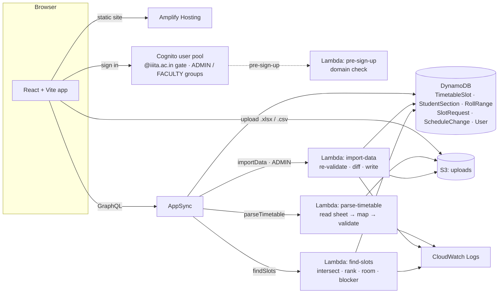

# Slate

**Find a free hour for a makeup class across several sections, in seconds instead of two days of WhatsApp polls.**

Live: **https://main.d1hpc7rjskshni.amplifyapp.com** (sign-in is limited to `@iiita.ac.in` accounts)

Built for **First Commit** (WeMakeDevs × AWS), Sept 17–20, 2026. Ship It track.

---

## The problem

At IIIT Allahabad, when a professor needs a makeup class, doubt session or extra lecture for a course that spans several sections or branches, nobody can see all those timetables at once. It becomes a WhatsApp poll to two or three class representatives, or an email thread that takes a day or two to find one hour when no section has a class. The information to answer it instantly already exists; it's just spread across separate timetable sheets that nobody has cross-referenced.

## What Slate does

| Who | Screen | What it does |
|---|---|---|
| Faculty | **Schedule a session** | Pick the sections that must attend (e.g. IT Sem 5 A, B, C + EC Sem 5 D), the days, time window and length. Slate returns the common free slots, **ranked with the reason spelled out** ("free for all 4 sections · within 9–5 · avoids the lunch hours · fits inside everyone's day") and a **free room**. If nothing works it names **the section that's blocking** ("Without IT Sem 5 Sec B, 1 slot works for everyone else, e.g. TUE 09:00–11:00, when Sec B has IML"). One click schedules it. |
| Students | **My timetable** | Their own week, worked out from their roll number (email), including B1/B2 lab groups, with newly scheduled sessions highlighted. |
| Faculty | **My teaching timetable** | Their classes across all sections. |
| Admin | **Upload data** | Upload the official timetable spreadsheets and student lists as they are. Slate reads them, checks them, shows exactly what would change, and applies only what the admin confirms. |
| Admin | **Students / Correct timetable** | Section-wise student lists and roll ranges (e.g. "B1 = rolls 108–160"), and click-to-fix editing of any class. |

Not built on purpose: voting or polls, chat, recurring sessions, student-created groups. The requester decides and Slate informs.

## Architecture



| AWS service | Used for |
|---|---|
| **Amplify Hosting** | The public site |
| **Amplify Gen 2** (CDK) | Everything below, defined in TypeScript under `slate/amplify/` |
| **Cognito** | Sign-in. A pre-sign-up Lambda only lets `@iiita.ac.in` emails register. **ADMIN** and **FACULTY** groups decide who may import data and who may confirm sessions. Groups, not a profile field, because users can edit their own profile row but only the AWS account can change group membership. |
| **AppSync + DynamoDB** | The data model and API, with per-model authorization (everyone signed in can read; only the right group can write) |
| **S3** | Uploaded source files; only the ADMIN group can upload |
| **Lambda × 4** | `parse-timetable`, `import-data` (ADMIN only), `find-slots`, and the pre-sign-up check |
| **CloudWatch Logs** | One structured line per upload (`upload-parsed`), import (`import-applied`, with who, which batch and what changed) and search (`slots-found`) |

**Cost:** everything is serverless and pay-per-request (no EC2, NAT gateway, RDS or OpenSearch), so it costs nothing when idle. During development Slate's own usage stayed under one US cent.

## How the timetable reading works, honestly

Institute timetables aren't standardised, and getting them in reliably was the hardest part of the project.

- **What's automatic.** The `parse-timetable` Lambda reads the official `.xlsx` sheets directly:
  - It works out the hour columns from the header row's own merged cells, and the days from column A.
  - It reads class cells in two formats: IT-style `IML (L) - Sec B (CC3-5207)` and single-section ECE-style `DSP (L)`.
  - It picks up the course list printed under the grid and any roll ranges listed there (`Sec A | IIT2026001 to IIT2026154`).
- **What's checked.** A merged cell can mean a 2-hour class or just a wide text box. Slate decides by checking which reading makes each section's weekly hours match the course's **L-T-P-S** in the course list. The same check flags mistakes in the sheets themselves, e.g. a lab written as `SS (T)` instead of `SS (P)`. Room and section clashes are flagged too. Nothing that fails a check is guessed; it's listed for the admin.
- **What falls back to a person.** Sheets that mix several programs, and electives with no section, aren't imported automatically. For any sheet Slate can't read, there's a flat **Slate template** (Day, Start, End, Course, Type, Section, Room, Faculty) that imports exactly. Every import is shown as new, changed and unchanged rows before anything is written.
- **What we planned but couldn't use.** The plan was Amazon Textract for PDFs plus Amazon Bedrock to normalise messy formats. On our new AWS account every Bedrock model's daily token quota was **0**, and that quota can't be raised from the console. A support request was the only route, and it couldn't resolve within the event. So the reader is deterministic code, validated against the sheets' own course lists, and PDFs aren't supported yet.
- **What was done by hand.** The first IT Sem 3/5 load was done with scripts in `slate/scripts/`. The deployed reader later re-read the same sheets and matched those rows exactly. Roll ranges for the IT 2024 batch were given by the team. B1/B2 splits still need to be entered on the Students tab once known.

## Run it yourself

Needs Node 20.19+ (or 22) and an AWS account configured for the CLI.

```bash
cd slate
npm ci
npx ampx sandbox          # deploys your own copy of the backend (Cognito, AppSync, DynamoDB, S3, Lambdas)
npm run dev               # http://localhost:5173
```

Give an account admin or faculty rights by adding it to the Cognito group (it must sign out and back in afterwards):

```bash
aws cognito-idp admin-add-user-to-group --user-pool-id <user_pool_id from amplify_outputs.json> \
  --username <cognito username> --group-name ADMIN   # or FACULTY
```

Publish the frontend to Amplify Hosting with `slate/scripts/deploy-frontend.sh`. `amplify.yml` at the repo root is ready if you'd rather connect the GitHub repo and let Amplify build and deploy both backend and frontend on every push.

## Repo map

- `slate/amplify/`: backend. `auth/`, `data/resource.ts` (schema and authorization), `storage/`, `functions/{parse-timetable,import-data,find-slots}/`
- `slate/src/`: frontend. `NewRequest.tsx` (scheduling), `StudentDashboard.tsx`, `TeacherDashboard.tsx`, `Admin*.tsx`, `components/TimetableGrid.tsx`
- `slate/scripts/`: offline reader and one-off data scripts, plus `deploy-frontend.sh`
- `CREDITS.md`: everything we used, including AI tools

## Team

Kavyan · Jalendu · Degama

MIT licensed, see `LICENSE`.
